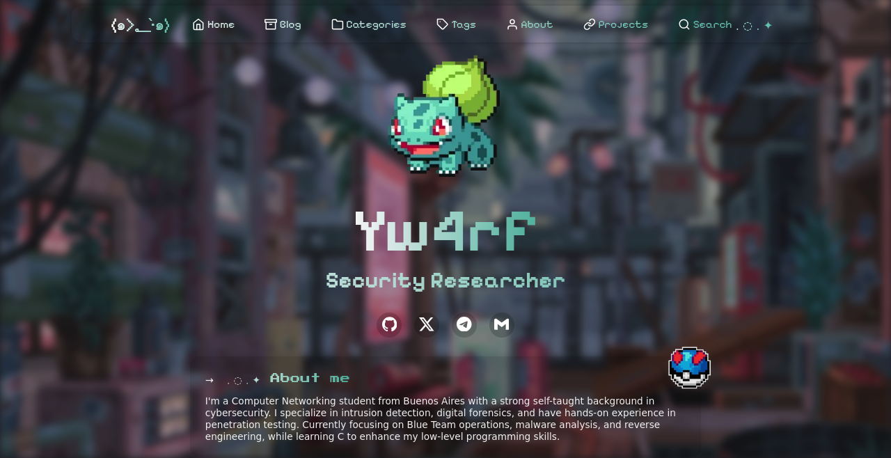

# Yw4rf Blog

 

**Pixel art design, drawing inspiration from retro gaming aesthetics and classic 8-bit art. This visual style not only makes the site unique but also reflects a passion for vintage computing and a nod to the foundational elements of digital creation.**

**Dive into intrusion detection, digital forensics, pentesting, and reverse engineering, often exploring how programming enhances security practices and tool development.**

 

**This blog is built upon [xingwangzhe's Stalux](https://github.com/xingwangzhe/stalux) repository. Nice template ♥**