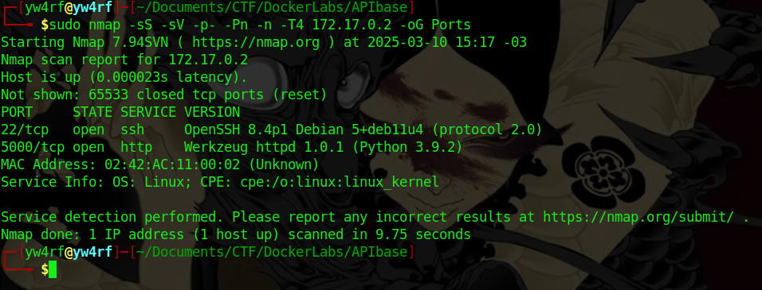
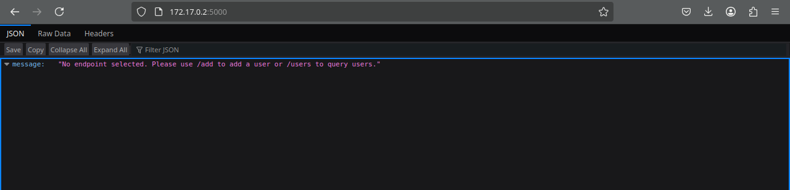
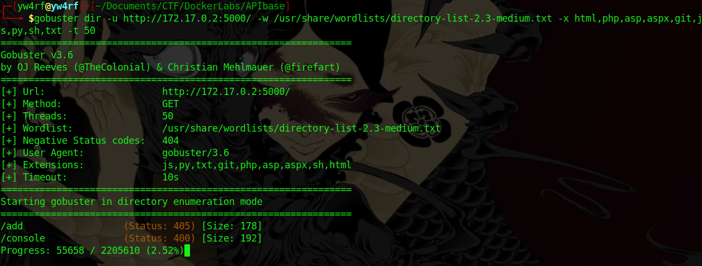
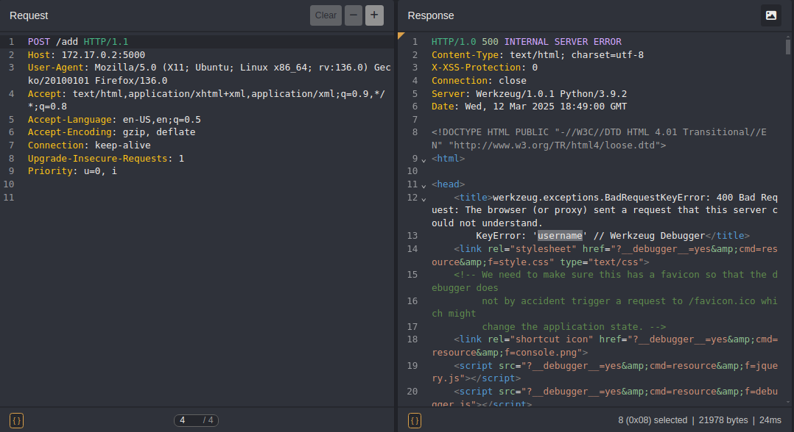
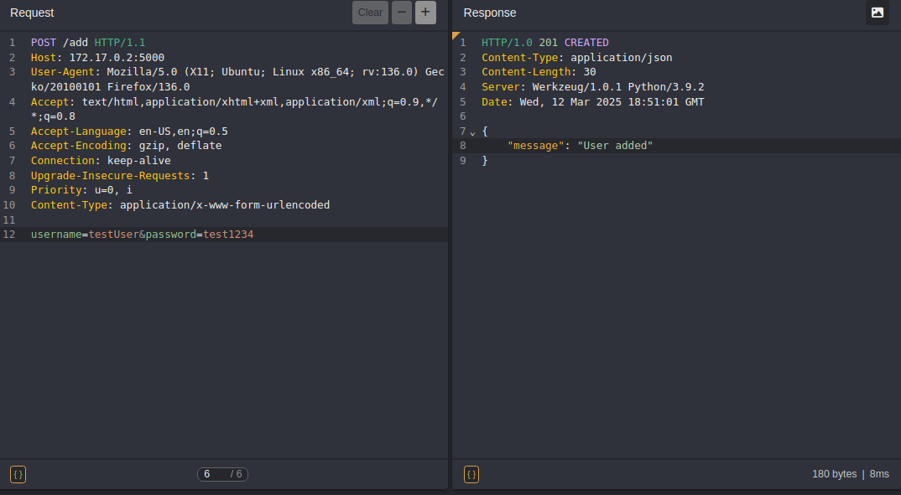
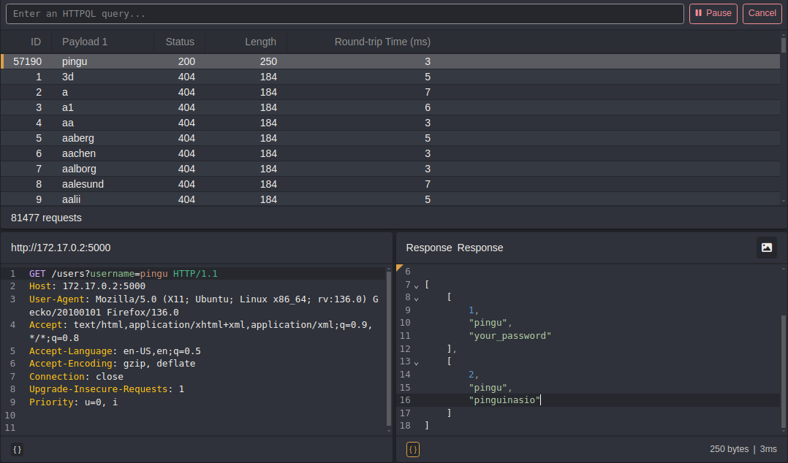
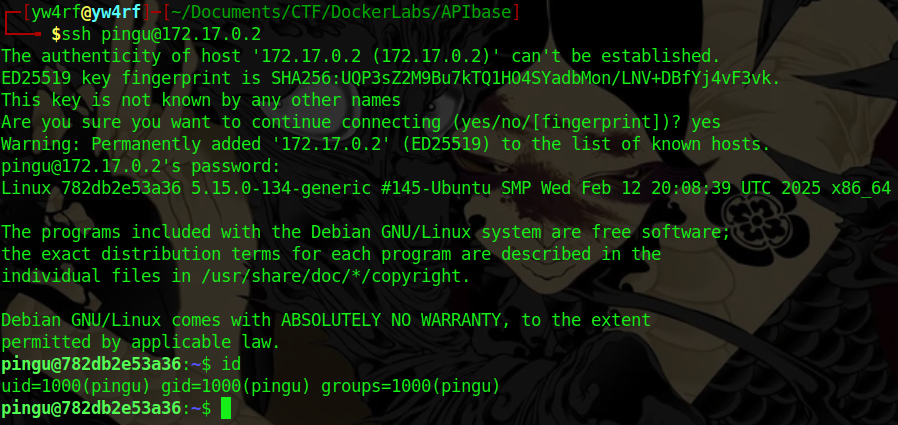
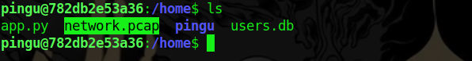
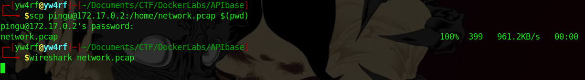

## Introduction

Se enumeraron los endpoints de una API, identificando que `/users` exponía información de usuarios y credenciales. Mediante un ataque de fuerza bruta con **Caido**, se logró acceder a una cuenta. Posteriormente, dentro del servicio **SSH**, se encontró un archivo `.pcap` que contenía consultas relevantes. Al analizarlo con **Wireshark**, se identificaron credenciales o patrones que permitieron escalar privilegios y obtener acceso como **root**.

~~~
Platform: DockerLabs
Level: Easy
OS: Linux
~~~

## Scanning

El comando **`nmap -sS -sV -p- -Pn -n -T4 10.10.11.38`** se emplea para escanear de manera agresiva **(`-T4`)** la máquina objetivo con el propósito de identificar puertos abiertos, servicios en ejecución y sus versiones. Esta información es clave para detectar posibles vulnerabilidades.

## Enumeration

### 22/SSH
El puerto 22 ejecuta el servicio SSH versión **OpenSSH 8.4p1**. De momento no tenemos ninguna vulnerabilidad que aprovechar para esta versión.

### 5000/TCP
El puerto 5000 ejecuta un servidor web HTTP **Werkzeug httpd 1.0.1** (Python 3.9.2). 

Al acceder al sitio nos encontramos con el mensaje **`No endpoint selected. Please use /add to add a user or /users to query users`** 

Realizo **directory brute-forcing** mediante **`Gobuster`** con el objetivo de encontrar directorios o archivos ocultos:

Al intentar acceder a **`172.17.0.2:5000/add`** nos indica **`Method Not Allowed. The Method is not allowed for the requested URL`** por lo que es posible inferir que es necesario otro método al realizar la petición al sitio:

**`Caido`** es una herramienta de **intercepción y análisis de tráfico web**, similar a **Burp Suite** o **ZAP (Zed Attack Proxy)**. Con está herramienta modificamos la petición del método **GET** al método **POST** (en la linea 1).

El error **`KeyError: 'username'`** indica que la aplicación está esperando un parámetro llamado **`"username"`**

Añado en la linea 10 **`Content-Type: application/x-www-form-urlencoded`** y luego el parámetro con su respectivo valor: **`username=testUser`**

Luego de añadir tal parámetro al enviar otra petición, nuevamente se muestra el error indicando que es necesario añadir el parámetro password **`KeyError: 'password'`**

Una vez añadidos ambos parámetros al enviar la petición la respuesta nos indica el mensaje **`"User added"`** 

Es posible utilizar el endpoint de la API **`/users`** para consultar usuarios existentes (Tal como nos indicaba al acceder al sitio en el puerto 5000 **`http://172.17.0.2:5000`**)

Enviamos la petición con el método **GET** y el parámetro añadido anteriormente **`/users?username=testUser`**, la respuesta nos indica **ID**, **Username** y **Password**. 

Parece ser que somos el **ID 3** por lo que deben existir **2** usuarios existentes creados antes que el nuestro.

## Exploitation

Utilizando **`Caido`** realizamos un **`brute-force attack`** con el fin de encontrar credenciales que nos permitan acceder:  

Se encontró el usuario **`pingu`** con sus respectivas credenciales:

~~~
1- pingu:your_password
2- pingu:pinguinasio
~~~

Se accedió correctamente mediante **SSH** con las credenciales **`pingu:pinguinasio`** encontradas anteriormente:  

## Privilege Escalation

Dentro del directorio **`/home`** se encontró un archivo **.PCAP** 

Con la herramienta **`scp (Secure Copy Protocol)`** que se usa para copiar archivos de manera segura entre un host remoto y uno local o entre dos ubicaciones remotas. Con **`$(pwd)`** le indico que quiero copiarlo en mi directorio actual.

Procedo a analizar el archivo **.PCAP** con la herramienta **`Wireshark`** 

Luego de analizar las consultas se encontraron credenciales comprometedoras:

~~~
root:balulero
~~~

Utilizamos el comando **`su root`** y luego ingresamos la credencial anteriormente hallada:

- `su` (substitute user) permite cambiar de usuario en el sistema.
- `root` es el nombre del usuario al se intenta cambiar.

**ROOTED**