## Introduction

_Alert_ es una máquina Linux de dificultad fácil con un sitio web para subir, ver y compartir archivos en formato markdown. El sitio es vulnerable a **Cross-Site Scripting (XSS)**, lo que permite acceder a una página interna vulnerable a **Local File Inclusion (LFI)**. Esto se aprovecha para obtener un **hash de contraseña**, que luego se **descifra** para obtener credenciales y acceder por **SSH**. Al enumerar los procesos en ejecución, se encuentra un archivo **PHP** que se ejecuta regularmente con privilegios elevados para un grupo al que pertenece el usuario comprometido. Esto permite **modificar el archivo y ejecutar código como root**.

~~~
Platform: HackTheBox
Level: Easy
OS: Linux
~~~

## Scanning

Se realiza un escaneo de múltiples etapas con la herramienta Nmap. Primero, identificamos los puertos abiertos:

Se encontraron los puertos abiertos **22/tcp** y **8080/tcp**. A continuación, realizamos un escaneo más detallado utilizando la flag **`-sCV`** para obtener más información de los puertos:

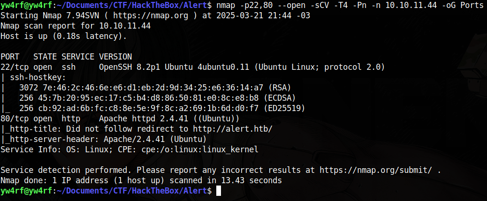

## Enumeration

#### 22/SSH
El puerto 22 ejecuta el servicio SSH versión **OpenSSH 8.2p1**. De momento no tenemos ninguna vulnerabilidad que aprovechar para esta versión.

#### 80/HTTP
El puerto 80 ejecuta un servidor web **Apache/2.4.41**. Al parecer redirige al dominio **`http://alert.htb`** por lo que es necesario añadir al dirección IP y el dominio al **`/etc/hosts`** para que sea posible acceder al sitio.

Una vez agregado el dominio navegamos hacia la página web, nos encontramos con un sitio que nos permite ver y compartir archivos Markdown. Cuenta con las secciones **Markdown Viewer, Contact Us, About Us y Donate**:

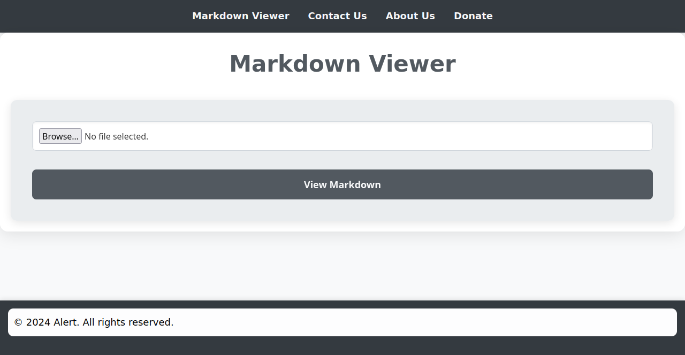

### Web Fuzzing

Se realiza **brute-forcing directory** mediante **`wfuzz`** con el fin de encontrar directorios o archivos ocultos dentro del sitio: Se encuentra el directorio **`/messages`** pero resulta en nada interesante de momento

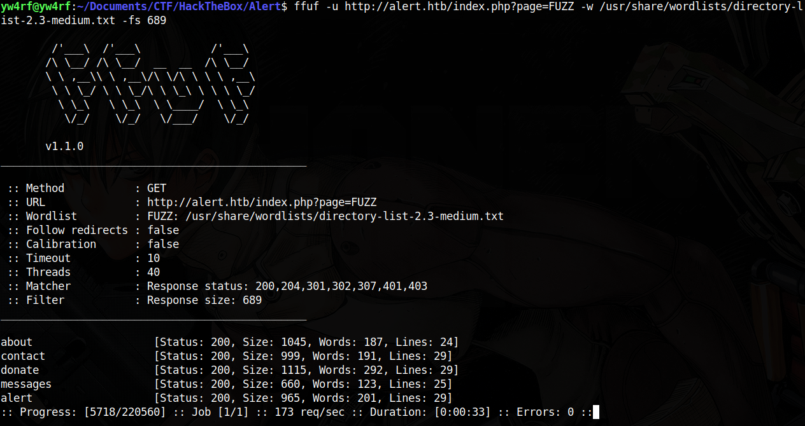

Realizamos **sub-domain enumeration** mediante **`wfuzz`** y encontramos el subdominio **`statistics`**. Es necesario igualmente agregarlo al **`/etc/hosts`**

Al acceder a **`http://statistics.alert.htb`** nos encontramos con un panel de autenticación con los campos **Username** y **Password**. De momento no es posible hacer nada allí.

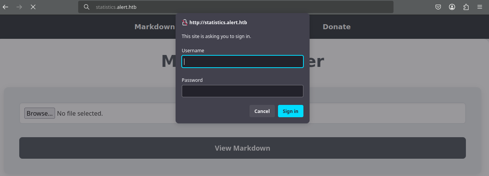

Al probar la subida de archivos con extensión **`.md`** (Markdown) en **`http://alert.htb`** notamos que lo lee correctamente y permite compartir el archivo mediante el botón **`Share Markdown`** generando asi un enlace hacia el mismo:

### XSS Vulnerability

Procedo a crear un archivo **`.md`** con el objetivo de probar si es vulnerable a **XSS (Cross-Site Scripting)**. Dentro del archivo escribo el siguiente código **JavaScript**: 

~~~js

~~~

Resulta ser efectivamente vulnerable a **XSS**. Esto nos permite probar distintos vectores de ataque:

Dentro de la sección **About Us** notamos que se menciona que el administrador se encarga de revisar los mensajes que se envian desde la sección de contacto. 

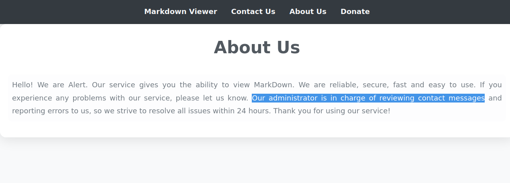

Teniendo en cuenta todo lo anterior, creamos un archivo **`.md`** con el siguiente código para intentar robar las cookies de sesión del administrador:

~~~JS

~~~

Luego de subir el archivo, copiamos su enlace.

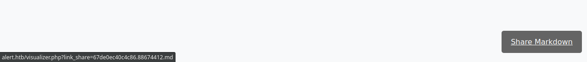

A continuación, ponemos nuestra máquina en escucha con **netcat** en el puerto `1717` (en mi caso):

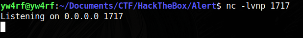

Después, en la sección **Contact Us**, enviamos el enlace del archivo previamente copiado.

Finalmente, recibimos una respuesta, lo que indica que el método funciona. Sin embargo, no logramos obtener la cookie de sesión.

## Exploitation

Modificamos el código anterior y escribimos uno nuevo que nos permite leer el contenido de la página desde la sección **messages**, y luego exfiltrarlo a nuestra terminal en escucha:

~~~JS

~~~

Este script realiza una solicitud GET a la página **messages**, y cuando recibe la respuesta, la envía codificada a base64 a nuestra máquina atacante para su exfiltración.

Desciframos la respuesta codificada en **base64** y logramos leer el código fuente de la sección **/messages**. Al analizarlo, encontramos un archivo llamado **`messages.php?file=2024-03-10_15-48-34.txt`**. Sin embargo, al intentar acceder a él mediante el mismo método, no obtenemos nada.

### LFI Vulnerability

A pesar de lo anterior, el parámetro **`file`** nos da la oportunidad de comprobar si es vulnerable a un **Local File Inclusion (LFI)**. Para probar esta vulnerabilidad, modificamos la URL del script, intentando leer el archivo **`/etc/passwd`**. Cambiamos la URL del script de la siguiente manera:

~~~JS

~~~

Al descifrar la respuesta obtenemos el **`/etc/passwd`**, esto nos permite enumerar los siguientes usuarios:

~~~
albert
david
~~~

A partir de aquí, sería posible llevar a cabo un ataque de fuerza bruta utilizando **`Hydra`**, aunque esto podría ser una pérdida de tiempo si la contraseña no resulta estar en el diccionario. Por lo tanto, decido explorar otros vectores.

Dado que hemos confirmado la capacidad de leer archivos del sistema mediante **LFI**, y considerando que se ejecuta un servidor web **Apache**, es razonable intentar leer archivos de configuración sensibles, como:

~~~
Configuración principal de Apache: 
/etc/apache2/apache2.conf       # Ubuntu/Debian
/etc/httpd/conf/httpd.conf       # CentOS/RHEL

Sitios y Virtual Hosts:
/etc/apache2/sites-available/default
/etc/apache2/sites-available/000-default.conf
/etc/httpd/conf.d/vhost.conf

Módulos habilitados:
/etc/apache2/mods-enabled/

Registro de Errores y Accesos:
/var/log/apache2/error.log
/var/log/apache2/access.log
/var/log/httpd/error_log
/var/log/httpd/access_log
~~~

Al leer el contenido de **`etc/apache2/sites-available/000-default.conf`** obtenemos la siguiente información: Esto revela información clave sobre la configuración del **virtual host** para **`statistics.alert.htb`**. El archivo **`.htpasswd`** ubicado en **`/var/www/statistics.alert.htb/.htpasswd`** se utiliza para gestionar credenciales. 

Se utiliza el siguiente script para obtener las credenciales:

~~~JS

~~~

Nos devuelve el usuario y el hash tipo **MD5 Apache (apr1)**
- `$apr1$` → Indica que el hash usa **MD5 Apache (apr1)**.
- `bMoRBJOg` → Es la **sal** utilizada en el hash.
- `igG8WBtQ1xYDTQdLjSWZQ/` → Es la **contraseña hasheada** usando el algoritmo MD5 con la sal.

~~~
albert:$apr1$bMoRBJOg$igG8WBtQ1xYDTQdLjSWZQ/
~~~

Mediante la herramienta **Hashcat** desciframos el contenido del hash: **`hashcat -a0 -m1600 /usr/share/wordlists/rockyou.txt`** se encontraron las siguientes credenciales: 

~~~
albert:manchesterunited
~~~

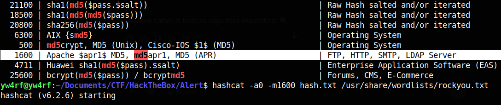

### SSH Access

Accedemos a **SSH** mediante las credenciales encontradas anteriormente. Al utilizar el comando **`id`** notamos que el usuario **albert** se encuentra dentro del grupo **`management`**

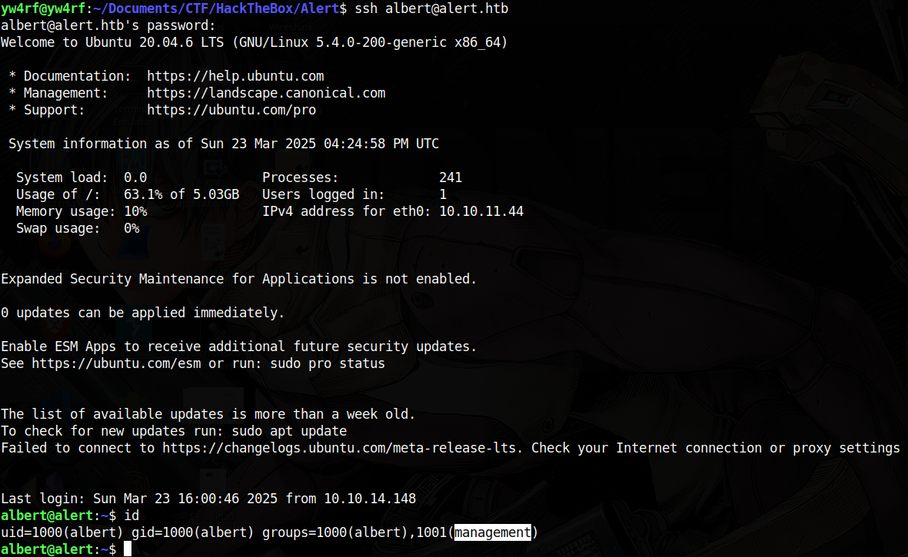

## Privilege Escalation

Se realizó un análisis de los procesos del sistema mediante la ejecución del comando **`ps aux`**, este comando lista todos los procesos en ejecución junto con el usuario que los ejecuta. Este mismo permitió identificar un proceso en ejecución perteneciente al usuario **root** ejecutando un servidor PHP como **root** en la dirección **`127.0.0.1:8080`**, con el siguiente comando: **``/usr/bin/php -S 127.0.0.1:8080 -t /opt/website-monitor``**

Por lo visto, se está utilizando el servidor web embebido de PHP (**`php -S`**). Ademas, solo está accesible desde la máquina local en el puerto **`8080`**. El **`t /opt/website-monitor`** indica que el contenido servido está en **`/opt/website-monitor`**.

### SSH Port Forwarding

> El **Port Forwarding** (reenvío de puertos) nos permite redirigir el tráfico de red de un puerto en la máquina víctima a nuestra máquina local, permitiéndonos acceder al servicio como si estuviera disponible en nuestra propia red

Se establece un túnel SSH para exponer el puerto **8080** del localhost de la víctima en nuestra máquina y así visualizar el sitio web desde nuestro navegador. Esto se realiza mediante el comando **`ssh -L 8080:127.0.0.1:8080 albert@alert.htb`**

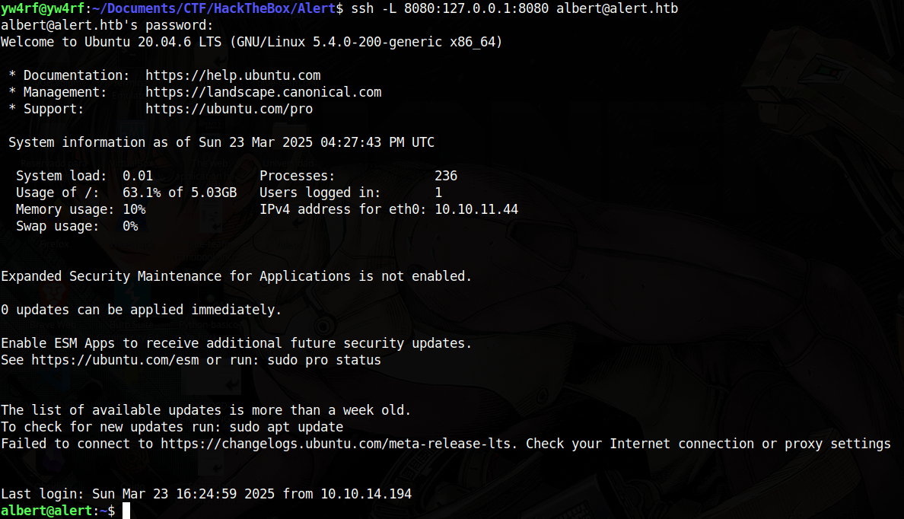

Esto nos permite abrir el sitio web en nuestro navegador como si estuviera en nuestra red local. No encontramos nada interesante en el sitio web.

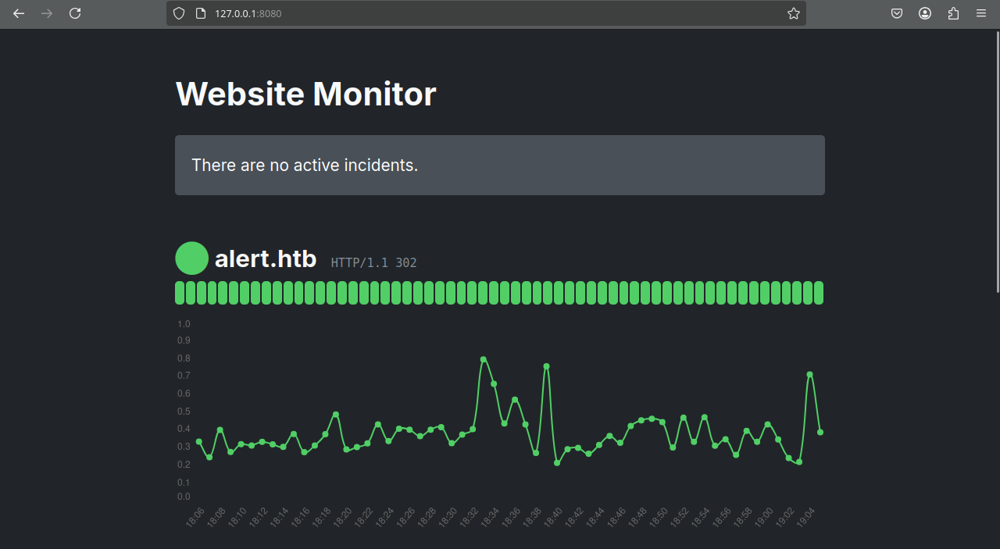

### Bit SUID 

Me dirijo a la ruta **`/opt/website-monitor`** donde se ejecuta el servidor del sitio y, utilizando **`ls -la`**, inspecciono los permisos de los archivos y directorios. Se observa que la carpeta **`config/`** tiene como propietario a **`root`** y pertenece al grupo **`management`**, con los permisos **`rwxrwxr-x`** (**775** en octal). Esto significa:
- **El usuario `root`** tiene permisos completos (**lectura, escritura y ejecución**).
- **Los usuarios del grupo `management`** también pueden **leer, escribir y ejecutar** dentro de la carpeta.
- **Otros usuarios del sistema** pueden **leer y ejecutar** los archivos, pero **no modificarlos**.

Dado que **`management`** tiene permisos de escritura, **albert** que pertenece a este grupo tambien puede modificar los archivos dentro de **`config/`**

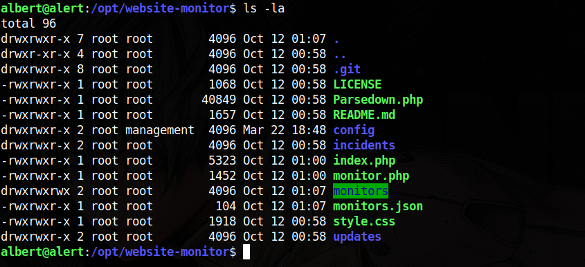

Dentro del directorio **`config/`** se encuentra el archivo **`configuration.php`** que pertenece al grupo **`management`** dentro encontramos código **PHP**. Procedo a modificar el código mediante el editor de texto **nano** procedo a modificar el archivo añadiendo la siguiente linea: 

~~~PHP
<?php
system('chmod u+s /bin/bash');
?>
~~~

Esto **habilita el bit SUID** en el ejecutable `/bin/bash`, permitiendo que **cualquier usuario que lo ejecute obtenga los privilegios del propietario** (que en este caso es `root`). Esto funciona debido a que el **servidor web PHP** se ejecuta con privilegios elevados, bajo **root**.

> Qué es el bit SUID? (`chmod u+s`)
> El bit SUID (Set User ID) es un permiso especial en sistemas Unix/Linux que permite a un usuario ejecutar un archivo con los privilegios del propietario del archivo en lugar de los del usuario que lo ejecuta.

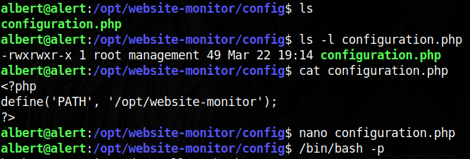

`bash` **ignora el bit SUID de forma predeterminada** para evitar escaladas de privilegios, por lo que al ejecutarlo con **`-p`** se le indica a **`bash`** que **NO ignore el bit SUID** por lo que al ejecutar **`/bin/bash -p`** luego de realizar lo anterior tendremos una shell con privilegios **root**:

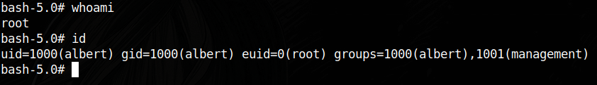

**ROOTED**

**[Verify Achievement](https://www.hackthebox.com/achievement/machine/2035837/636)**

