## Introduction

Está máquina de **[HackTheBox](https://app.hackthebox.com/)** comienza con un escaneo de puertos utilizando Nmap, identificando un servidor web Apache y un servicio SSH expuesto. La enumeración del sitio web revela un archivo APK descargable, el cual, tras ser descompilado, expone información sensible, incluyendo subdominios y una clave de API utilizada en una interfaz Swagger UI. A partir de esta clave de API, se accede a una funcionalidad administrativa que permite leer archivos de logs, explotando una vulnerabilidad de Local File Inclusion (LFI) para filtrar archivos sensibles, incluyendo una clave privada de SSH. Esto permite obtener acceso al sistema como un usuario no privilegiado. Finalmente, se explora la máquina descubriendo un backup encriptado de Solar-PuTTY, el cual se descifra para recuperar credenciales de acceso al usuario root, completando así la escalada de privilegios.

~~~
Platform: HackTheBox
Level: Medium
OS: Linux
~~~

## Scanning

Como primer paso se realiza un escaneo de puertos con la herramienta **Nmap**

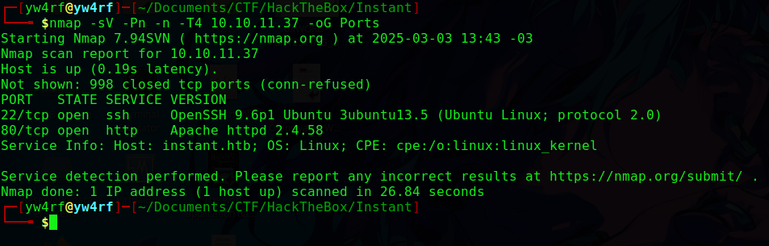

## Enumeration

#### 22/SSH

El puerto 22 ejecuta el servicio SSH versión **OpenSSH 9.2p1**. De momento no tenemos ninguna vulnerabilidad que aprovechar para esta versión.

#### 80/HTTP

El puerto 80 ejecuta un servidor web **Apache/2.4.58**. El uso de **whatweb** reporta un correo electronico **`support@instant.htb`** y el uso de **`JQuery[3.2.1]`** en la página **`Instant Wallet`**. Utilizando **Gobuster** se realiza **directory bruteforcing** con el fin de encontrar directorios o archivos ocultos no listados:

La única interacción con la página se encuentra en el botón "**Download Now!**", este mismo descarga un archivo llamado **`instant.apk`**  

Parece ser que se encuentra en el directorio **`http://instant.htb/downloads/`** por lo que igualmente es posible obtenerlo mediante **`wget`**

Se realiza la descompilación y análisis del código mediante la herramienta **`apktool`** aunque también es factible el uso de la herramienta **[MobSF](https://mobsf.live/)**. Ambas son herramientas enfocadas en el análisis de aplicaciones moviles y son bastante convenientes ya que en este caso estamos ante un archivo **.APK (Android Application Package)**

Se emplea el comando **`apktool d instant.apk`** para descomprimir el archivo, esto deja como resultado una carpeta con el nombre **`instant/`**. Con el comando **`tree instant/`** se busca visualizar de forma estructurada la jerarquia de los directorios existentes dentro:

Se busca dentro del directorio con el comandd **`find instant/res/`** y filtro los resultados con **`grep -riE "password|api|token|user"`** con el fin de buscar palabras en específico.

Entre uno de esos archivos se encuentra lo que es un **subdominio** **`mywalletv1.instant.htb`**. El intento de acceder al mismo revela que no es posible incluso si se añade al **`/etc/hosts`**

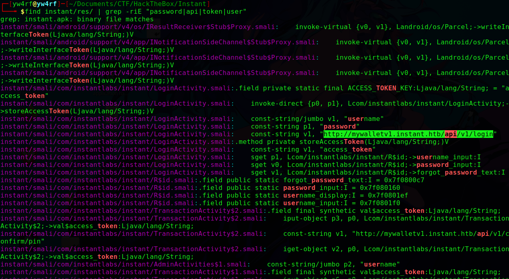

Utilizo el mismo comando para buscar desde la raíz del directorio **`instant/`** cualquier referencia al dominio **`instant.htb`**, filtrando los resultados para identificar posibles subdominios adicionales.

En primer lugar notamos el subdominio encontrado anteriormente y luego el subdominio **`swagger-ui.instant.htb`**

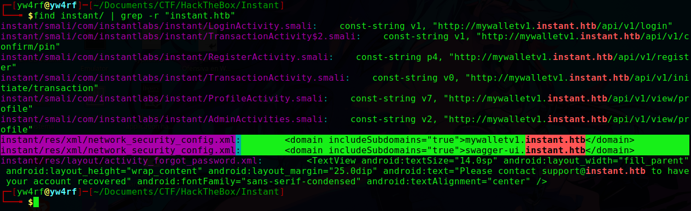

> Swagger UI es una herramienta de código abierto que permite visualizar y probar APIs que siguen la especificación **OpenAPI**. Proporciona una interfaz gráfica interactiva donde los desarrolladores pueden explorar los endpoints de una API, ver detalles sobre las solicitudes y respuestas, y probar llamadas HTTP sin necesidad de escribir código manualmente en herramientas como Postman o CURL.

Luego de añadir el subdominio encontrado al **`/etc/hosts`** notamos que es posible acceder al mismo, más no es posible utilizar los endpoints de la API debido a que es necesario tener la **apiKey**  

Utilizo **`find`** en combinación con **`grep`** para buscar desde la raíz del directorio **`instant/`** cualquier referencia a la palabra **`admin`**. El archivo **`AdminActivities.smali`** se repite mucho por lo que con **`cat`** procedo a inspeccionarlo encontrando asi la **`apiKey`**

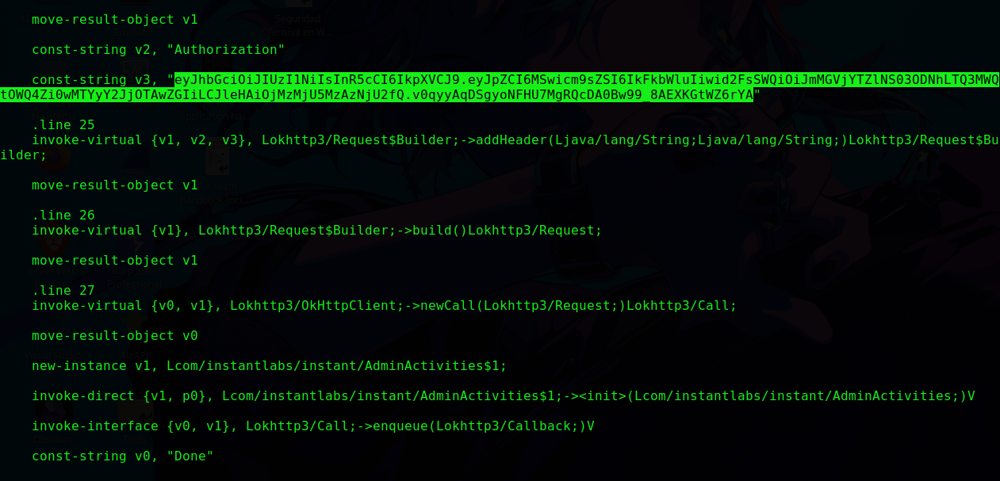

Se realiza la comprobación ingresando el valor de la **`apiKey`** encontrada e ingresa correctamente por lo que el token de autorización es valido:

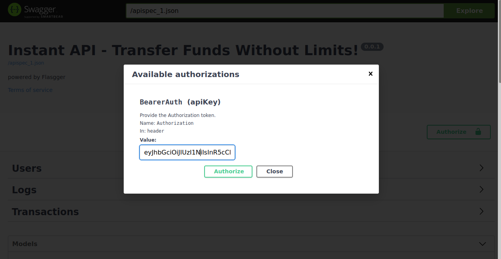

En la página oficial de **[JWT (JSON Web Token)](https://jwt.io/)** es posible decodificar el token, esto da como resultado: 

~~~
{ 
"id": 1,
"role": "admin",
"walID": "f0eca6e5-783a-471d-9d8f-0162cbc900db",
"exp": 33259303656,
}
~~~

## Exploitation

En la sección de **Logs** de la API es posible leer archivos logs, se observa un campo de entrada y por lo visto luego de ingresar cualquier parametro envia una petición con el método **`GET`** a **`http://swagger-ui.instant.htb/api/v1/admin/read/logs?log_file_name=`** por lo que es factible intentar ver si es vulnerable a **`LFI (Local File Inclusion)`** 

En el campo de entrada ejecutamos **`../../../../../etc/passwd`** y funciona. Por lo que se concluye es vulnerable a **`LFI`**:

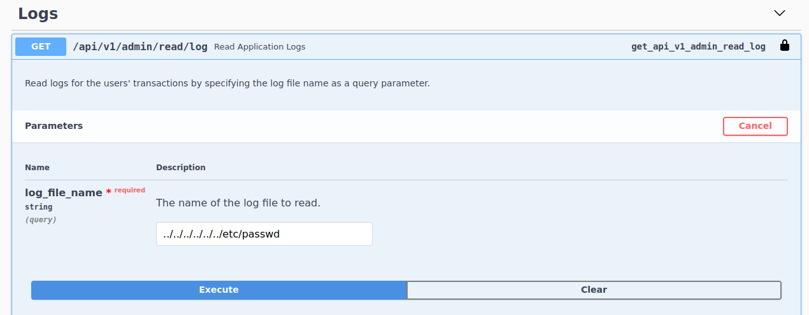

Podemos observar la existencia del usuario llamado **`shirohige`**

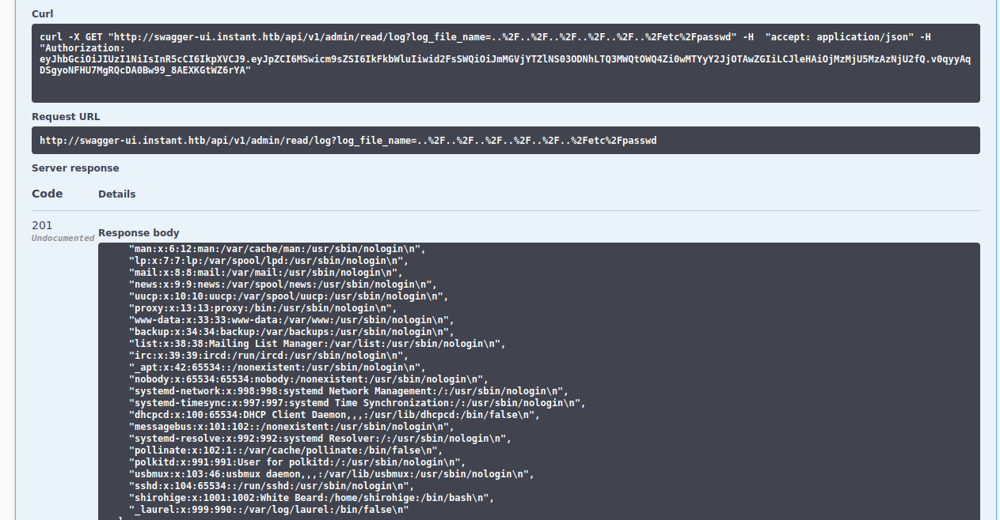

No se tiene acceso al **`/etc/shadow`** por lo que se intenta leer la clave privada **`id_rsa`** de **SSH**. Mediante **cURL** es posible realizar la misma petición aunque realizarlo desde la terminal permite la utilización de expresiones regulares para la eliminación de saltos de linea (\n) y las comillas dobles ("") del output:  

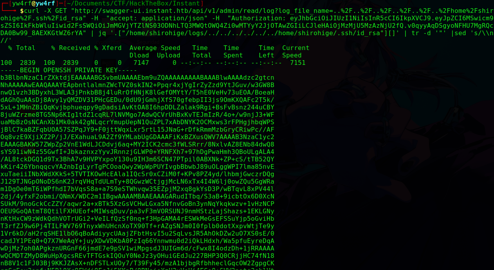

La salida la envio directamente a un archivo con el nombre de **`id_rsa`** y le doy permisos de lectura y escritura con el comando **`chmod 600`**. Se ingresa a **SSH** utilizando la clave privada mediante el comando **`ssh -i id_rsa shirohige@10.10.11.37`**

## Privilege Escalation

Una vez dentro como el usuario **`shirohige`** se buscan los archivos y directorios que pertenecen a tal usuario. Se filtran los resultados con **`grep`** con el fin de eliminar resultados innecesarios (esto hasta encontrar algo interesante). Se encontró un archivo llamado **`sessions-backup.dat`** en el directorio **`/opt/backup/Solar-PuTTY/`**

> Solar-Putty es una aplicación que permite a los usuarios administrar sesiones remotas y conectarse a cualquier dispositivo en la red

Este archivo parece ser un backup encriptado por Solar-PuTTY. Los archivos backup pueden contener credenciales por lo que para descifrar el contenido primero es necesario enviarlo a nuestra máquina local, esto se realiza con el comando **`python3 -m http.server 8080`** 

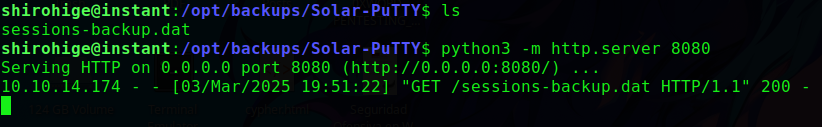

Luego desde nuestra máquina local se obtiene el archivo con el comando **`wget http://10.10.11.37:8080/sessions-backup.dat`**

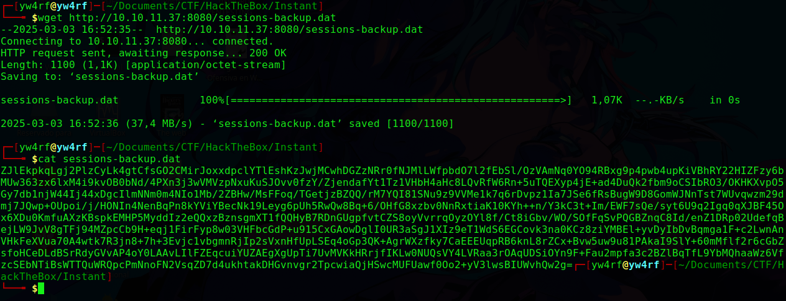

Para descifrar correctamente el contenido del archivo **`sessions-backup.dat`** se utiliza el script **[SolarPuttyDecrypt.py](https://gist.github.com/xHacka/052e4b09d893398b04bf8aff5872d0d5)**  

Esto se realiza mediante el comando **`python3 SolarPuttyDecrypt.py [fileToDecrpt] [wordlist]`** una vez descifrado el archivo en el contenido se pueden observar credenciales:

~~~
username: root
password: 12**24nzC!r0c%q12
~~~ 

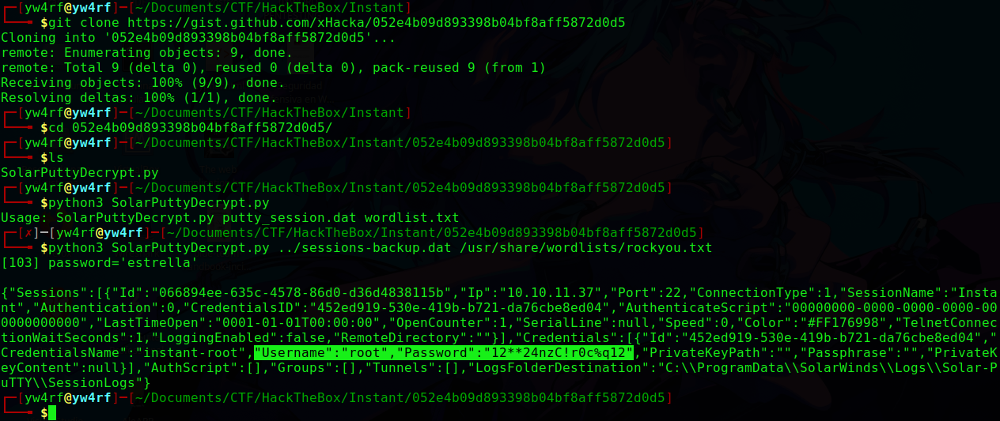

Con el comando **`su root`** se cambia al usuario root, se ingresa la credencial obtenida anteriormente e ingresamos al sistema:

**ROOTED**

**[Verify Achievement](https://www.hackthebox.com/achievement/machine/2035837/630)**

